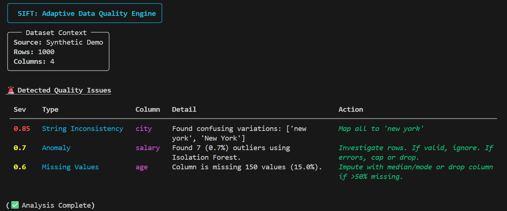

# Sift: Adaptive Data Quality Engine (DQE)

[](https://badge.fury.io/py/sift-dqe)


**Sift** is a deterministic, explainable engine designed to detect, rank, and suggest fixes for data quality issues in tabular datasets.

Unlike "black box" AI tools that hallucinate fixes, Sift uses a transparent **3-Layer Architecture** to provide statistically backed remediation strategies without requiring labeled training data.



---

## 🧠 Core Architecture

Sift operates on a "Bounded Intelligence" principle—it doesn't guess semantics, it measures deviation.

| Layer | Component | Tech Stack | Responsibility |
| --- | --- | --- | --- |
| **1** | **Structural Profiler** | `Polars` | Infers types, cardinality, missingness patterns, and mode statistics at high speed. |
| **2** | **Inference Engine** | `Scikit-Learn` | **Isolation Forest:** Detects high-dimensional outliers.<br><br>**Clustering:** Uses N-Grams + Agglomerative Clustering to find fuzzy duplicates (e.g., "NY" vs "New York"). |
| **3** | **Issue Synthesizer** | `Python` | Contextualizes findings into a "Severity Score" (0.0 - 1.0) to prioritize system-breaking issues over minor warnings. |
| **∞** | **Chaos Monkey** | `NumPy` | A built-in stress tester that injects synthetic corruption (nulls, drift, typos) to verify the engine's detection rate. |

---

## ⚡ Quick Start

### 1. Installation

Install Sift directly from PyPI:

```bash
pip install sift-dqe

```

*(For development/source installation, see [Project Structure](https://github.com/Nbisht1208/Sift?tab=readme-ov-file#-project-structure--development))*

### 2. Run the Interactive Demo

See Sift in action against an internally generated dataset. The engine will spin up, inject random errors (via Chaos Monkey), and attempt to detect them live.

```bash
sift demo

```

---

## 🛠️ Usage Guide

### 📂 Analyzing Your Own Data

Sift is production-ready for CSV and Parquet files. It will automatically detect types and run the full 3-Layer analysis.

```bash
sift analyze path/to/your/file.csv

```

### 🏥 Running the "Healthcare" Case Study

Included in the library is a generator for a messy healthcare dataset (containing real-world errors like "Blood Pressure" formatting issues and Typos).

1. **Generate the Data:**

```bash
# Generates 'healthcare_messy.csv' in your current directory
python -m sift.case_study 

```

2. **Analyze it:**

```bash
sift analyze healthcare_messy.csv

```

**What to look for:**

* **String Inconsistency:** Sift will detect `["BlueCross", "bluecross"]` as the same entity.
* **Missing Values:** It will flag the injected nulls in the Weight column.

### 🛡️ The Reliability Scorecard (Benchmark)

How do you know you can trust Sift? Run the **Benchmark**.
This command runs the engine through **20 simulation cycles**, injecting random permutations of errors each time to calculate a strict "Recall Rate."

```bash
sift benchmark

```

*Expected Output:*

```text
🛡️ Reliability Scorecard
┏━━━━━━━━━━━━━━━━━━━━━━━━━━━┳━━━━━━━━━━┳━━━━━━━━━━┳━━━━━━━━━━━━━┓
┃ Test Case                 ┃ Injected ┃ Detected ┃ Recall Rate ┃
┡━━━━━━━━━━━━━━━━━━━━━━━━━━━╇━━━━━━━━━━╇━━━━━━━━━━╇━━━━━━━━━━━━━┩
│ Missing Value Injection   │       20 │       20 │      100.0% │
│ Extreme Outlier Injection │       20 │       20 │      100.0% │
└───────────────────────────┴──────────┴──────────┴─────────────┘
⭐ Overall Engine Reliability Score: 100.0%

```

---

## 📂 Project Structure & Development

If you wish to contribute or modify the source code:

```bash
git clone https://github.com/PranavKndpl/Sift
cd sift
poetry install

```

```text
sift/
├── data/               # Storage for case studies and raw files
├── docs/               # Architecture decision records & failure modes
├── src/sift/
│   ├── chaos_monkey/   # Error injection modules (The "Attacker")
│   ├── core/           # The Brain (Profiler, Inference, Synthesizer)
│   ├── cli.py          # Main CLI entry point
│   ├── dashboard.py    # Rich-based UI logic
│   └── scorecard.py    # Reliability benchmarking logic
└── tests/              # Pytest suite

```

## ⚠️ Known Limitations

Sift is designed to be **safe**, which means it has specific operational boundaries (e.g., small dataset sensitivity, Benford's law gating). Please read the full [Failure Modes Documentation](https://github.com/Nbisht1208/Sift/blob/main/docs/failure_modes.md) before deploying in production.

